<style>
p.caption {
  font-size: 0.8em;
}
</style>

```{r, include=FALSE}
knitr::opts_chunk$set(
  collapse = TRUE,
  comment = "#>",
  message = FALSE,
  warning = FALSE
)
```

# Introduccion a R

## Qué es R

 `R` es un lenguaje de programación libre y gratuito, especialmente indicado para análisis estadístico y elaboración de gráficos. Se trata de una versión libre de otro programa que se llama S o S-plus, desarrollado por los Laboratorios Bell. Todo el código de R está disponible como software libre bajo las condiciones de licencia GNU-GPL.

Podéis acceder al proyecto R desde un buscador escribiendo  `R project` o visitando directamente su página http://www.r-project.org

## Instalación de R

Instalar `R` es fácil, independiente de si usas `Windows`, `Mac` o `Linux`. Basta con ingresar a https://cran.r-project.org/ y seguir las instrucciones de descarga e instalación.

Si te resulta complicado (no lo creo), a continuación encontrarás unas instrucciones generales, paso a paso, para instalar el software en tu ordenador. En primer lugar escribe "download R" en tu buscador. Haz clic a la primera entrada que aparece, donde pone “Download R-4.0.0 for Windows". El buscador siempre te sugiere la versión mas actualizada del programa, qué es con la que recomendamos que trabajes. Por defecto, te sugiere una version para `Windows`. Si utilizas `Mac` o `Linux`, solamente escribe "download R Mac" (o Linux) en el buscador y sigue los pasos de descarga e instalación.

En las imágenes a continuación, veréis que sale la versión R 3.6.2 que no coincide con la versión que instalaréis vosotros. Esto se debe a que se han publicado versiones más actualizadas desde que preparé este material. Vosotros debéis instalar siempre la versión más actualizada que esté disponible.

```{r echo=FALSE, out.width='60%', fig.cap= "Figura 1. Descarga de R desde un buscador"}
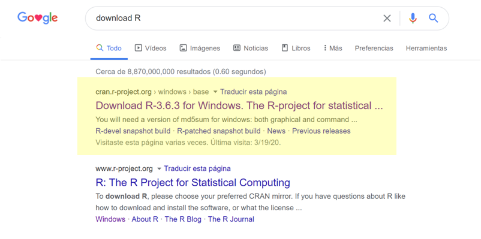
```

En la página que se abre, debes darle a un link que dice "Download R-3.6.3 for Windows". Cuando hagas clic, se descargará en tu ordenador un ejecutable que se llama "R-3.6.3-win.exe" (o la versión de R que ofrezca Cran)

```{r echo=FALSE, out.width='60%', fig.cap= "Figura 2. Página de R project desde la cual se realiza la descarga. Debes hacer clic donde pone Download R señalado en amarillo"}
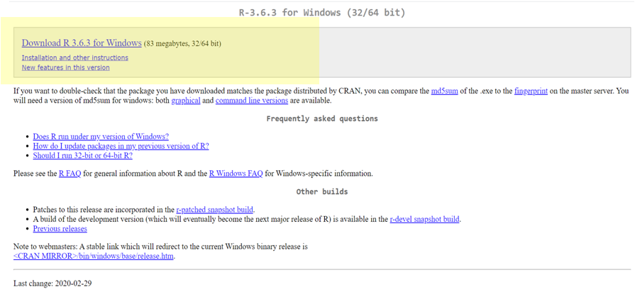
```

Haz clic en el ejecutable que has descargado para proceder con la instalación. 
La instalación es muy sencilla, solamente tienes que ir haciendo "clic" en " aceptar" o "siguiente" sin modificar ninguna de las opciones que te da por defecto. Lo primero que te pregunta es que selecciones el idioma. Esta opción la puedes cambiar al idioma que tu prefieras. El curso se imparte en español, pero puedes elegir inglés o el idioma que prefieras para el programa.

```{r echo=FALSE, out.width='50%', fig.cap= "Figura 3. Selecciona el idioma"}
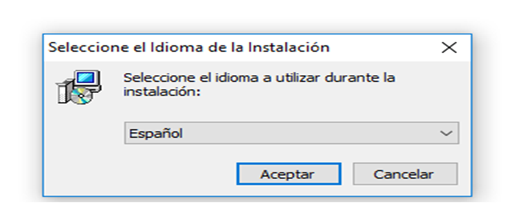
```

A continuación tienes las imágenes de los cuadros que se irán abriendo, para que te resulte familiar. 

Simplemente haz clic en siguiente:

```{r echo=FALSE, out.width='50%', fig.cap= "Figura 4. Haz clic en siguiente"}
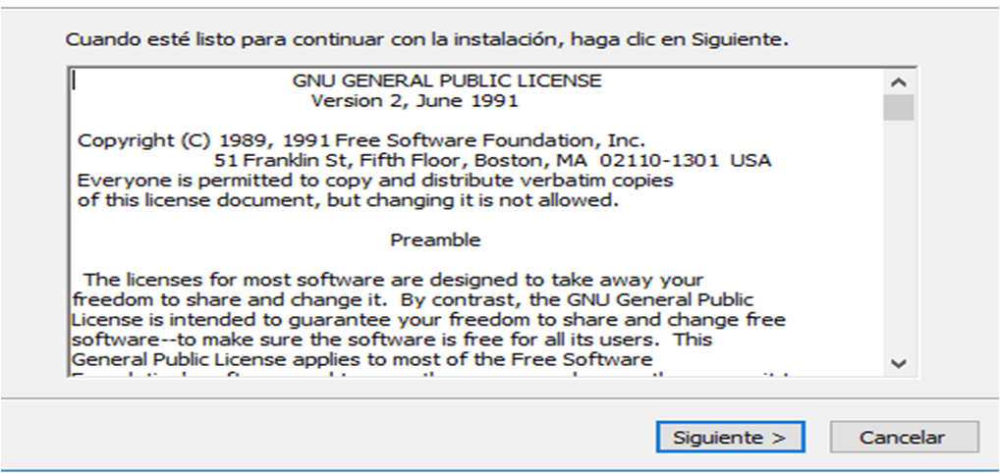
```

Haz clic en siguiente:

```{r echo=FALSE, out.width='50%', fig.cap= "Figura 5.  Haz clic en siguiente"}
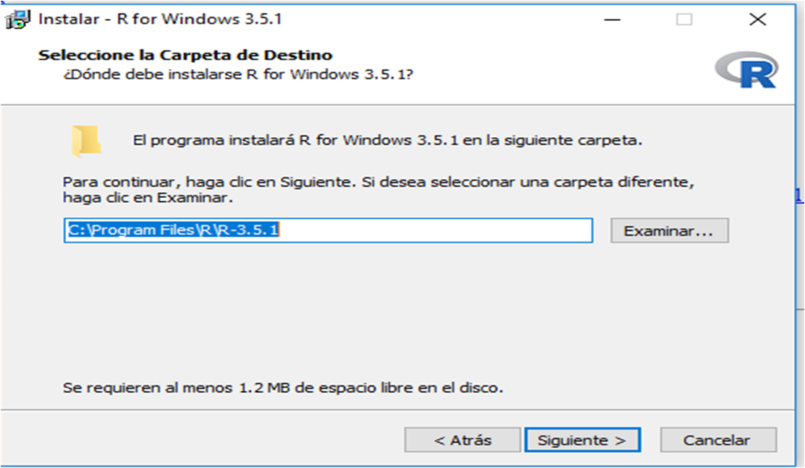
```

Espera a que se instale el programa en tu sistema:

```{r echo=FALSE, out.width='50%', fig.cap= "Figura 6. Espera a que termine la instalación"}
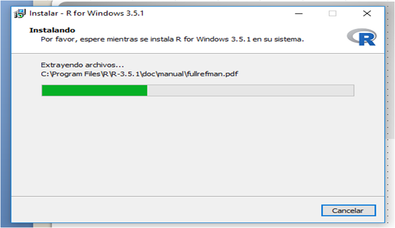
```

Haz clic en siguiente:

```{r echo=FALSE, out.width='50%', fig.cap= "Figura 7. Haz clic en siguiente"}
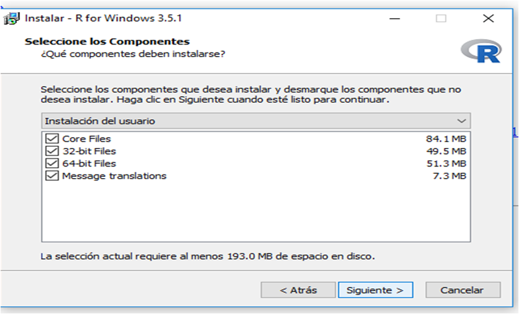
```

Cuando llegues a este cuadro, haz clic en finalizar. Ya tendrias `R` instalado en tu ordenador.

```{r echo=FALSE, out.width='50%', fig.cap= " Figura 8. Haz clic en finalizar"}
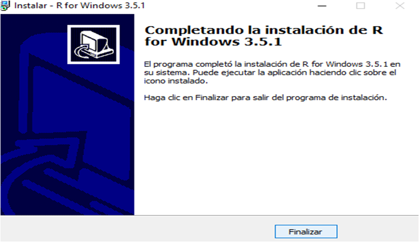
```

## Instalación de Rstudio

```{r echo=FALSE, out.width='30%', fig.cap= "Figura 9. Logo de RStudio"}

```

`RStudio` es una plataforma que ayuda a programar con `R`. Es decir, utiliza `R` como lenguaje de programacion. Podemos utilizar `R` con o sin `RStudio`, pero no podemos utilizar `RStudio` sin `R`. El uso que hagamos de esta herramienta es personal, y cada persona decide si quiere utilizarla o no. Nosotros proponemos el uso de `RStudio`, porque nos resulta una herramienta muy util y facilita el uso de `R` y de sus multiples aplicaciones, por lo que el curso lo vamos a desarrollar utilizando `RStudio`. 

Para instalar `RStudio`, es necesario tener instalado `R`.  La descarga e instalación es accesible en `Windows`, `Mac` y `Linux`. El link es https://www.rstudio.com/products/rstudio/download/#download

```{r echo=FALSE, out.width='60%', fig.cap= "Figura 10. Descarga de RStudio"}
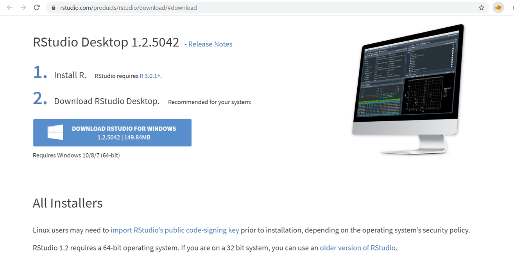
```

## Introducción al uso de RStudio

Una vez descargados `R` y `RStudio`, basta con que hagas clic simbolo de RStudio para comenzar a trabajar. 

### Partes de RStudio

Una vez abierto RStudio, observaras una pantalla parecida a la de la Figura 11, conformada por cuatro paneles. Los colores de la pantalla en tu caso, seran diferentes. Mas adelante aprenderemos a cambiarlos. Por ahora fijate en los cuatro paneles que aparecen

```{r echo=FALSE, out.width='60%', fig.cap= "Figura 11. Interfaz de RStudio. Esta inferfaz se compone por cuatro paneles"}
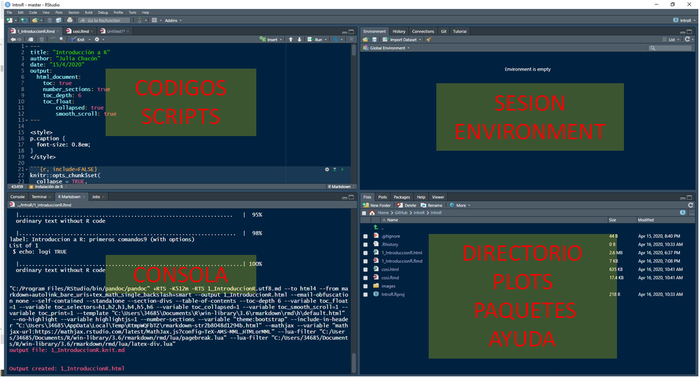
```

#### Consola

En el panel inferior izquierdo de `RStudio` nos encontraoms con la consola. Es la parte principal de `RStudio` y `R` en general. Es el lugar donde escribimos los codigos en lenguaje `R` para dar ordenes al programa. Los codigos tambien pueden llamarse comandos. 

Prueba a escribir tu primer comando en la consola:

```{r Consola, echo=TRUE}
7+3
```

En la consola siempre aparece el simbolo del prompt `>` 
Este simbolo nos indica que podemos escribir una orden o comando, porque el programa esta listo para recibir esa orden

#### Códigos o scripts

En el panel superior izquierdo de `RStudio` es donde escribimos los codigos o comandos, en lenguaje `R`, pero esta vez en una especie de cuaderno o bloc de notas para comandos, que podemos guardar para repetir los analisis cuando queramos o compartir nuestros códigos.

Esos archivos se llaman `R Script`. Veremos muchos a lo largo del curso. Para poder abrir nuestro primer `R Script`, tenemos que presionar la pestaña con el simbolo de suma que aparece en la parte superior izquierda, y seleccionar `R Script` (Figura 12). Se abrirá automáticamente un archivo en blanco donde podemos empezar a escribir comandos.

```{r echo=FALSE, out.width='60%', fig.cap= "Figura 12. Ubicación de los R Script"}
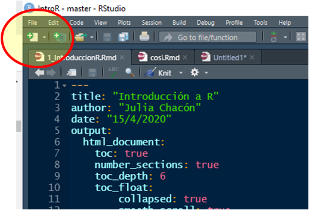
```

Otras formas de abrir un nuevo script:

- directamente escribiendo `Crtl + Shift + N`
- en `File > New File > R Script`

En este `R Script`. cada línea representa un comando. Para que una línea que escribimos ahí se ejecute debemos presionar `Ctrl + Enter` (En Mac, `Cmd + Enter`). Puedes seleccionar varias líneas a la vez y correrlas juntas presionando `Ctrl + Enter` 

Podemos poner comentarios explicativos en un código de R simplemente escriendo el símbolo del numeral `#` delante del código. Todo texto que presente este símbolo `#` delante, no se ejecuta, y se considera un comentario.

```{r Códigos o scripts, echo=TRUE}
7+3  # Esto es un comentario. R sólo correrá el código hasta el símbolo #
```

Los R Scripts se guardan:

- Presionando `Ctrl + S`
- `File > Save`

#### Environment o sesión

En la parte superior derecha de la consola hay varias pestañas: Environment, History y Connections. La más importante es la pestaña Environment, en ella aparecerán los "objetos" que vayamos creando a medida que trabajamos. R almacena objetos, con los que luego podemos realizar otras operaciones.

Veamos un ejemplo, aunque más adelante entenderemos lo que son los objetos. Escribe en tu consola lo siguiente:

```{r Environment o sesión, echo=TRUE}

cosa <- 2 + 3 # podemos almacenar la suma 2 + 3 en forma de un objeto que se llama "cosa"

cosa # si ahora escribes "cosa" en tu consola, aparece directamente el resultado de la suma.

# Puedes comprobar cómo ahora "cosa" es un objeto que queda almacenado en Environment
```

Para asignar un valor a un objeto se utiliza la flecha `<-`
La forma correcta de utilizarlo sería `nombre_de_lobjeto <- contenido_asignado`

Más adelante trabajaremos los objetos, de momento sólo quiero que veas que se almacenan en tu `Environment` y que eso te permite consultarlos más adelante.

Otra pestaña interesante es History. Se trata de un historial, donde aparecen todos los comandos que has escrito durante la sesión de R en la cuál estás trabajando. Te permite recuperar códigos que has perdido o consultar qué has estado haciendo

#### Directorio, Gráficos, Paquetes y Ayuda

En la parte inferior derecha de `RStudio` aparecen varias pestañas de nuevo: File, Plots, Packages, Help, Viewer. File es simplemente el directorio de trabajo donde te encuentras trabajando, es decir, la carpeta dónde estás trabajando y todos los archivos que en ella se encuentran guardados. 

La pestaña Plots es donde aparecerán las figuras que hagamos. En Packages aparecen los paquetes descargados. Help es una pestaña de consulta o ayuda. No te preocupes, iremos viendo todas las funcionalidades de RStudio a lo largo del curso, de forma intuitiva y natural.

## Introducción a R: una primera aproximación al lenguaje de programación

Una vez instalados R y Rstudio, podemos abrir el programa haciendo doble clic sobre el icono de Rstudio. De momento utilizaremos solo la consola. La consola es la herramienta principal del programa, donde nosotros vamos a escribir comandos y ejecutar operaciones.

En la parte de arriba de la consola, al inicio, siempre aparece informacion basica del programa, por ejemplo, la version de R que estamos utilizando.

Al comienzo de la linea de comando siempre aparece este simbolo   `>`

Cuando vemos este simbolo, significa que el programa esta esperando a que escribamos una orden.

Podemos ejecutar una suma:
```{r Introducción a R: primeros comandos, echo=TRUE}
2+2
```

El símbolo de numeral `#` es utilizado para hacer comentarios:
```{r Introducción a R: primeros comandos2, echo=TRUE}
#  3 + 4
```

Como véis no ocurre nada.

El uso más sencillo que se le puede dar a R es el de una calculadora. Consideremos las siguientes operaciones:

- Adición: `+`
- Resta: `-`
- Multiplicación: `*`
- División: `/`
- Exponenciación: `^`
- Módulo: `%%`

Los últimos dos necesitan una breve explicación:

- El operador `^` eleva el número a la izquierda a la potencia a la derecha `3^2` es 9
- El módulo (mod) `%%` calcula el residuo de la división del número a la izquierda por el número a la derecha, por ejemplo 5 mod 3 o `5%%3` es 2.

Ejemplos:

Adiciones y restas:
```{r Introducción a R: primeros comandos3, echo=TRUE}
2+3+4+5-6
```

Si se presiona Enter antes de tiempo, el programa nos permite terminar la operacion en la siguiente.
```{r Introducción a R: primeros comandos4, echo=TRUE}
2+3+4+5-
  6

```

Multiplicación:
```{r Introducción a R: primeros comandos5, echo=TRUE}
2*4
```

División:
```{r Introducción a R: primeros comandos6, echo=TRUE}
2/4
```

Combinación de operaciones:
```{r Introducción a R: primeros comandos7, echo=TRUE}
2+3*6
```

Utilizando los paréntesis se puede indicar el orden de las operaciones:
```{r Introducción a R: primeros comandos8, echo=TRUE}
(2+3)*6
(2+3)/6
2+3/6
```

Otros: exponencia, logaritmo, raíz cuadrada...
```{r Introducción a R: primeros comandos9, echo=TRUE}
6^2
log(10)
sqrt(4)
```
## Instalar y cargar paquetes

Los paquetes de R son colecciones de funciones y datos que guardan algún tipo de relación entre sí.

R tiene un sistema que se denomina "base", que contiene funciones básicas para análisis estadístico y visualización. Pero además de estas funciones básicas podemos extender la funcionalidad de R con los paquetes que hacen trabajos más específicos. Por ejemplo, existen paquetes para visualización de datos como ggplot2, para análisis geoespacial, analisis de datos ecologicos, para organizar datos, y para muchísimas cosas más.

Los paquetes de `R` se encuentran alojados en `CRAN` (https://cran.r-project.org/), donde pasan controles antes de estar disponibles para el uso general.

Existe la opción de crear tus propios paquetes, cuando tienes colecciones propias de funciones que quieres almacenar y compartir con el resto de la comunidad.

Podemos instalar paquetes de diferentes formas. 

Una es utilizando la función `install.packages()`. El nombre del paquete que queremos instalar debe ir entre comillas. Una vez instalado el paquete, la función que nos permite cargar esa librería se llama `library()`. Veamos algunos ejemplos y otras funciones que pueden ser interesantes.

```{r Instalar y cargar paquetes, echo=TRUE, eval=FALSE}

install.packages("vegan") # Para instalar un paquete

library(vegan) # sirve para cargarlo en la sesión de R en la que estamos trabajando.

(.packages()) # proporciona una lista de los paquetes cargados en este momento

(.packages(all.available=TRUE)) # Devuelve la lista de paquetes disponibles

# Podemos tratar de cargar la librería tree
library (tree)  # pero este comando no funciona porque no está en nuestra lista de paquetes disponibles

install.packages("tree") # Debemos instalar el paquete primero, y después cargarlo
library(tree)#  ahora sí lo podemos cargar y no da error

remove.packages("vegan") # elimina este paquete 

(.packages(all.available=TRUE)) # Puedes comprobar que ya no aparece en la lista de paquetes disponibles
```

También podemos instalar paquetes utilizando el menú de `RStudio`: Tools > Install packages…

O desde el panel de abajo a la derecha de `RStudio`: Packages/Install. Nos permite ver los paquetes que tenemos actualmente instalados y aquellos que se encuentran cargados.

```{r Instalar y cargar paquetes2, echo=FALSE, out.width='60%', fig.cap= "Figura 14. Lista de paquetes instalados"}
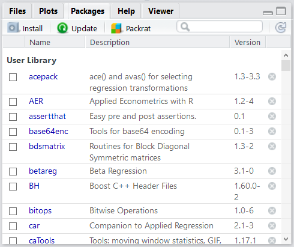
```

## Estrategias de búsqueda de ayuda 

En muchas ocasiones necesitaremos ayuda sobre los argumentos o funcionamiento de una función concreta, o simplemente porque nos encontramos frente a un error. Lo más común es llamar a la función de ayuda de `R` que es `help()`

La función`help()` nos permite pedir ayuda sobre funciones concretas. Ejemplo sobre pedir ayuda de la función genérica `plot()`:

```{r Ayuda en R, echo=TRUE}
help(plot)
?plot
```

También podemos buscar ayuda sobre un paquete concreto, ejemplo con el paquete ggplot2:

```{r Ayuda en R2, echo=TRUE, eval=FALSE}
install.packages("ggplot2") # Instalar ggplot2
library(ggplot2)  # Cargar ggplot2
library(help= "ggplot2") # Pedir ayuda sobre el paquete ggplot2
```

Tambien existen las vignettes, que son unos tutoriales especificos que en ocasiones acompañan a los paquetes. 

```{r Ayuda en R3, echo=TRUE, eval=FALSE}
vignette() # Proporciona una lista de vignettes a las que podemos acceder
vignette(package="ggplot2") # Proporciona una lista de vignettes a las que podemos acceder para ggplot2
vignette("ggplot2-specs", package="ggplot2") # acceso a una vignette concreta de ggplot2
```

Y por supuesto, existen infinidad de recursos en internet. En el siguiente apartado te proponemos muchas webs y comunidades de ayuda.


## Otros recursos y comunidades de ayuda


### Páginas generales

[Libro de recetas](http://www.cookbook-r.com/)

[R pubs](http://rpubs.com/)

[R bloggers](https://www.r-bloggers.com/)

[R for stats](http://r4stats.com/)

[Data camp](https://www.datacamp.com/)

[R open science](https://ropensci.org/)

[Revolution analytics](https://blog.revolutionanalytics.com/)

### Libros online y físicos

[Modelos estadísticos de Ben Bolker](https://ms.mcmaster.ca/~bolker/emdbook/)

[Programación eficiente](https://csgillespie.github.io/efficientR/introduction.html)

[R for data science de Hadley Wickham](https://r4ds.had.co.nz/)

[R avanzado de Hadley Wickham](https://adv-r.hadley.nz/)

[ggplot](https://www.springer.com/us/book/9780387981413)

[Gramática de gráficos](https://www.amazon.es/dp/B00HWUVHXK/ref=dp-kindle-redirect?_encoding=UTF8&btkr=1)

[Libro de recetas](shop.oreilly.com/product/0636920023135.do)

[The R book](https://www.cs.upc.edu/~robert/teaching/estadistica/TheRBook.pdf)

[RMarkdown](https://bookdown.org/yihui/rmarkdown/)

[Tablas con RMarkdown y KableExtra](https://cran.r-project.org/web/packages/kableExtra/vignettes/awesome_table_in_html.html#installation)

[Citas bibliográficas con RMarkdown](http://vivaelsoftwarelibre.com/insertar-referencias-bibliograficas-en-r-markdown/)

[R para ecólogos](https://www.springer.com/us/book/9780387898810)

### Ayuda general

[R podcast](https://r-podcast.org/)

[Repositorio de chuletas](https://www.rstudio.com/resources/cheatsheets/)

### Visualizacion de datos

[Página oficial de ggplot](https://ggplot2.tidyverse.org/)

[Galería de gráficos](https://www.r-graph-gallery.com/)

[Recetas/parte de gráficas](http://www.cookbook-r.com/Graphs/)

### Estadística básica

[Estadística básica](https://www.statmethods.net/stats/index.html)

[Tutoriales de introducción](http://www.r-tutor.com/elementary-statistics)

[R4stats](http://r4stats.com/)

[Estadística avanzada](http://www.sthda.com/english/wiki/r-basic-statistics)


### Genética

[Bioconductor](https://www.bioconductor.org/)

[Genética de poblaciones](https://popgen.nescent.org/)

### Ecología

[Vegan](https://rdrr.io/rforge/vegan/man/vegan-package.html)

[ADE4](http://pbil.univ-lyon1.fr/ade4/home.php?lang=eng)


### Cuentas populares de Twitter

<blockquote class="twitter-tweet" data-lang="es"><p lang="es" dir="ltr">&quot;R cambió mi opinión sobre el género humano al observar cuántas personas están realmente dispuestas a participar en actividades colectivas, buscando algo que trasciende a sus propios intereses. Se realizan muchas actividades sin que haya un reconocimiento individual.&quot;<br>Ross Ihaka <a href="https://t.co/lx0vUCXdHW">pic.twitter.com/lx0vUCXdHW</a></p>&mdash; Rosana Ferrero (@RosanaFerrero) <a href="https://twitter.com/RosanaFerrero/status/1057212329270673408?ref_src=twsrc%5Etfw">30 de octubre de 2018</a></blockquote>
<script async src="https://platform.twitter.com/widgets.js" charset="utf-8"></script>


<blockquote class="twitter-tweet" data-lang="es"><p lang="es" dir="ltr">¿Cómo ser un usuario de <a href="https://twitter.com/hashtag/R?src=hash&amp;ref_src=twsrc%5Etfw">#R</a> resiliente? <br>Interesante presentación provista por <a href="https://twitter.com/ma_salmon?ref_src=twsrc%5Etfw">@ma_salmon</a> con tips que nos ayudarán a no desistir en el proceso de aprendizaje de este lenguaje. Al final siempre vendrán grandes recompensas.<a href="https://t.co/ilsYcx2Y0K">https://t.co/ilsYcx2Y0K</a><a href="https://twitter.com/hashtag/rstats?src=hash&amp;ref_src=twsrc%5Etfw">#rstats</a> <a href="https://twitter.com/hashtag/DataScience?src=hash&amp;ref_src=twsrc%5Etfw">#DataScience</a> <a href="https://twitter.com/hashtag/dataviz?src=hash&amp;ref_src=twsrc%5Etfw">#dataviz</a> <a href="https://t.co/HlZm2MyAFo">pic.twitter.com/HlZm2MyAFo</a></p>&mdash; tipsder (@tipsder) <a href="https://twitter.com/tipsder/status/1058367762060505089?ref_src=twsrc%5Etfw">2 de noviembre de 2018</a></blockquote>
<script async src="https://platform.twitter.com/widgets.js" charset="utf-8"></script>


<blockquote class="twitter-tweet" data-lang="es"><p lang="en" dir="ltr">Does including emoji in your RMarkdown make you go 😦😫😱? Struggle no more: <a href="https://t.co/wgCTnsgVAn">https://t.co/wgCTnsgVAn</a> emo::ji(&quot;celebrate&quot;) 🎉 <a href="https://twitter.com/hashtag/rstats?src=hash&amp;ref_src=twsrc%5Etfw">#rstats</a></p>&mdash; Hadley Wickham (@hadleywickham) <a href="https://twitter.com/hadleywickham/status/856938704748896258?ref_src=twsrc%5Etfw">25 de abril de 2017</a></blockquote>
<script async src="https://platform.twitter.com/widgets.js" charset="utf-8"></script>


<blockquote class="twitter-tweet" data-lang="es"><p lang="en" dir="ltr">Just published: Reproducible science - what, why, how <a href="https://t.co/AuFeMPK1bw">https://t.co/AuFeMPK1bw</a> <a href="https://twitter.com/hashtag/reproducibility?src=hash&amp;ref_src=twsrc%5Etfw">#reproducibility</a> <a href="https://t.co/dAXShbilBJ">pic.twitter.com/dAXShbilBJ</a></p>&mdash; F Rodriguez-Sanchez (@frod_san) <a href="https://twitter.com/frod_san/status/768041676497620992?ref_src=twsrc%5Etfw">23 de agosto de 2016</a></blockquote>
<script async src="https://platform.twitter.com/widgets.js" charset="utf-8"></script>


<blockquote class="twitter-tweet" data-lang="es"><p lang="en" dir="ltr">Like super specific <a href="https://twitter.com/hashtag/NBA?src=hash&amp;ref_src=twsrc%5Etfw">#NBA</a> stats? Like getting data right in <a href="https://twitter.com/hashtag/rstats?src=hash&amp;ref_src=twsrc%5Etfw">#rstats</a>? 🏀<a href="https://twitter.com/abresler?ref_src=twsrc%5Etfw">@abresler</a>&#39;s made like a whole BUNCH of your [hoop] dreams come true…<br>📦 &quot;nbastatR: R&#39;s interface to NBA data&quot; <a href="https://t.co/UMaLbh24B6">https://t.co/UMaLbh24B6</a> (seriously, you don&#39;t even have to assign names!! 😵) <a href="https://t.co/5V8ZQdAdjO">pic.twitter.com/5V8ZQdAdjO</a></p>&mdash; Mara Averick (@dataandme) <a href="https://twitter.com/dataandme/status/1058740421877288962?ref_src=twsrc%5Etfw">3 de noviembre de 2018</a></blockquote>
<script async src="https://platform.twitter.com/widgets.js" charset="utf-8"></script>


<blockquote class="twitter-tweet" data-lang="es"><p lang="en" dir="ltr">First module of SQL basics at <a href="https://twitter.com/udacity?ref_src=twsrc%5Etfw">@udacity</a> completed. It’s a relief to have learnt R and Java before. I’m advancing very quickly!</p>&mdash; Pablo Herrera (@pherreraariza) <a href="https://twitter.com/pherreraariza/status/1055774343765127168?ref_src=twsrc%5Etfw">26 de octubre de 2018</a></blockquote>
<script async src="https://platform.twitter.com/widgets.js" charset="utf-8"></script>
